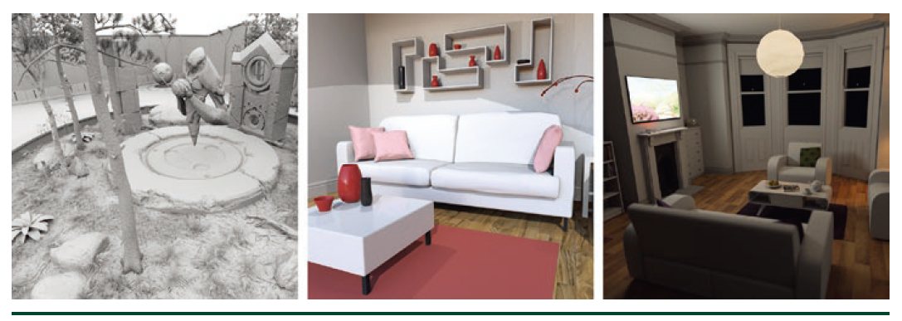

### 挖掘更深和更多的资源

&nbsp;&nbsp;&nbsp;&nbsp;在本章中，我们尝试提供了DirectX射线跟踪扩展的概述，以及它们背后的适当心智模型。我们特别关注了着色器和主机端代码的基础，您需要使用DXR启动和运行这些代码。无论你编写自己的代码或者有一些问题吗?看看交换机举日志库(例如,如Falcor)为你提供它,从这一点上使用光线追踪变得更加容易:一旦完成了基本设置,添加更多的射线追踪的效果往往是简单改变材质的几行代码。显然，我们有限的介绍性章节不能再深入了。我们鼓励您探索提供基本DirectX基础结构代码、示例、最佳实践和性能技巧的各种其他资源。

&nbsp;&nbsp;&nbsp;&nbsp;2018课程“DirectX射线追踪入门”[12]可以在YouTube上找到，它提供了一个深入的DXR着色器教程[11]，使用Falcor框架[2]抽象底层的DirectX细节，允许您专注于核心光传输细节。这些教程将介绍一些基本知识，如打开窗口、创建简单的G-buffer、使用环境遮挡渲染以及用于抗混叠和景深的高级相机模型，以及完整的multiplebounce全局光照。图3-4显示了使用教程代码呈现的几个示例。

&nbsp;&nbsp;&nbsp;&nbsp;&nbsp;&nbsp;&nbsp;&nbsp;&nbsp;&nbsp;&nbsp;&nbsp;&nbsp;&nbsp;&nbsp;&nbsp;&nbsp;&nbsp;&nbsp;&nbsp;&nbsp;&nbsp;&nbsp;&nbsp;**图3-4.**   使用SIGGRAPH 2018课程“DirectX射线追踪入门”教程的示例效果图。

&nbsp;&nbsp;&nbsp;&nbsp;其他有用的教程包括那些关注较低层主机代码的教程，包括Marrs的API示例[3]，它启发了本章的后半部分，Microsoft的一组介绍性DXR示例[6]，以及Falcor团队[1]的底层示例。此外，NVIDIA在其开发人员博客[8]上有各种资源，包括额外的代码示例和演练。

