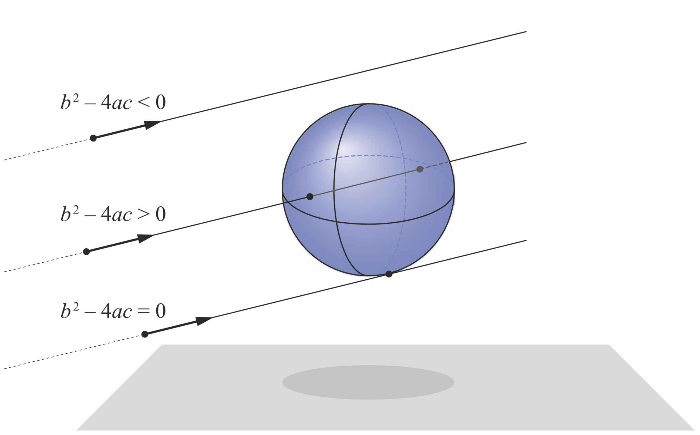

# 第七章：光线/球体相交检测的精度优化

## 摘要
计算光线/球体相交的传统方法是直接解二次方程。
虽然这种因式分解法在数学上是正确的，但是在使用浮点数进行计算时可能会出现数值不稳定性。
本文给出两种不常见的方程解法，并且展示他们对计算精度的优化效果。

## 7.1 光线/球体相交基础
球体是最容易用来光线追踪的物体之一，因此很多早期的光线追踪生成的图片都以球体作为主体。如图 7-1。 
 
  
*图7-1：球形分形雪花场景。地面是一个巨大的球体。场景中有四千八百万个球体，其中大多数要小于一个像素[9]* 
 
任意球体都可以用他的中心坐标 G 和半径 r 来定义。对于此球体表面上的任意点P, 有方程： 
(P-G)×(P-G)=r2.     【1】 
在求解球体与光线的相交时，上式中的P应被替换成 R(t) = O + t **d**（见第二章）。令 **f** = O - G, 并简化方程，即可得到： 
(**d**⋅**d**) t2 + 2(**f**⋅**d**) t + **f**⋅**f** - r2 = at2 + bt + c = 0      【2】 
此二次方程的解是 
t0,1 = (- b ± b2-4ac) / (2a)     【3】  
如果判别式 Δ = b2-4ac < 0, 则光线与球体不相交；
如果Δ = 0，则光线刚好擦过球体表面 （即两个交点重合）；
如果Δ > 0, 那么两个不同的t值则对应着两个不同的交点。如图7-2。 
 
  
*图7-2：光线/球体相交检测。三种不同的情况，从上到下分别为，不相交，两个交点，和单个交点（两个重合的交点）*  
 
将t值带入光线方程，即可得到两个交点：P0,1 = R(t0,1) = O + t0,1**d**。
在计算出交点（比如P0）之后，这一点的单位法线为 
**n** = P0 - G        【4】 

## 7.2 浮点数精度问题
浮点数运算很容易出现很大的问题，尤其是是使用32位浮点数来实现式【3】的时候。
这里将给出两种常见情况的补救方法：球体半径相对于到光线起始点的距离非常小（图7-3），光线临近一个巨大的球体（图7-4）。 
 
  
*图7-3：4个单位球（r=1），距离正交相机的距离从左到右分别是100，200，2000，4100。
直接实现式【3】可能带来严重的浮点数误差，甚至检测不到相交（距离4100的情况）。*  
 
  
*图7-4：二次方程精度问题：使用一个巨大的球体作为地面，
直接求解【左】，和使用Press等人[6]提出的更加稳定的解法【右】，放大后的结果* 
 
为了理解这些误差出现的原因，这里将简单介绍浮点数的一些性质。
除了符号位之外，浮点数被表示为 s × 2e 的形式，其中固定位数的s和e分别表示有效数和幂数。
在进行运算时，较小的浮点数的有效数需要进行右移，因此其最右边的位数将会丢失，所以精度会受损。
单精度浮点数有24个有效数位，所以对于任意一个单精度浮点数，加上一个比它小224 ≈ 107倍的浮点数将不会改变结果。 
 
这个有效数字丢失的问题在计算式【2】中的 c = **f**⋅**f** - r2 时非常显著，
这是由于数字在做减法之前先被平方，也就意味着有效数位减半。
**f**⋅**f** = ‖O-G‖2 是球心到光线起始点的距离的平方，
所以如果球体到 O 的距离大于 212r = 4096r，那么球体半径 r 在相交计算过程中则不会被考虑到。
即使在更短的距离，视觉误差也会出现，因为r的有效数位只剩下很少的几位。见图7-3。 
 
Hearn 和 Baker[3]给出了一个对于小球体数值上更加稳定的解法，并被Sony Pictures Imageworks用作样例[4]。
此解法的思路是重新表示  b2-4ac。
这里使用 **v** ⋅ **v** = ‖**v**‖2 = v2 来表示向量模长： 
 
  b2-4ac    
= 4**d**2 ( (**f** ⋅ **d**)2 / ‖**d**‖2  -  (**f**2-r2) )  
= 4**d**2 ( r2 -  (**f**2 - (**f**⋅$\hat{d}$)$\hat{d}$ )2 )   

