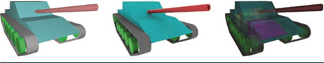

自从50年前引入领域以来, 光线追踪一直被用于解决计算机图形学中的可见性问题。首次命中遍历返回与光线相交的最近图元的信息, 如图9.1中左图所示。当使用递归遍历以后, 首次命中遍历也可以用于添加诸如折射、反射以及其他形式的间接照明等视觉效果。因此, 大多数光线追踪API都着重于优化首次相交的性能。
另一类光线遍历，任意命中遍历，也常被应用于计算机图形学。任意命中遍历的相交查询不限于返回最近相交的图元，而是简单地返回指定区间内光线是否与任意图元相交。任意命中光线遍历特别适用于诸如阴影和环境光遮蔽等特效，如图9-1(中图)所示。
在第三类光线遍历，即多重命中光线遍历[5]中，一次相交查询返回与一条光线相交的N 个最近图元的相关信息。多重命中遍历泛化了首次命中遍历(N = 1)和使光线查询返回每一个相交图元的相关信息的全命中遍历(N = ∞)，同时也可以使N取这两个极端之间的任意值。
多重命中光线遍历在许多计算机图形学应用中都很有用，例如快速而精确的透明物体渲染。基于光栅化的方案需要在GPU上进行昂贵的片元(fragment)排序且必须进行扩展才能够正确地渲染共面物体1。相比之下，多重命中遍历提供了一种简单直接的方法用来实现能够正确处理重叠共面物体的高性能透明渲染。
>如Gribble等人对同时存在于透明渲染和基于物理的仿真中的共面物体问题进行了更彻底的讨论[5]，感兴趣的读者可以参考该文献以获得更多细节。

图9-1 三类光线遍历。首次命中遍历和任意命中遍历是计算机图形学应用中众所周知的常用算法，用于实现可见性检测(左图)和环境光遮蔽(中图)等效果。我们探讨的多重命中光线遍历，即第三类光线遍历，按照相交点顺序返回N个最近的图元 (N ≥ 1)。多重命中光线遍历在许多计算机图形学和基于物理的仿真应用中都非常有用，包括光学透明性 (右图)。

重要的是，多重命中遍历也可广泛用于各种基于物理的仿真或所谓非光学渲染，如图9-1(右图)所示。在诸如弹道穿透、射频传播、热辐射传递和其他一些领域中，相关现象服从类似于比尔-朗伯定律(Beer-Lambert Law)的方程，因而需要光线/图元区间的信息，而不仅是相交点。这些仿真类似于渲染一些其中所有物体都表现为参与介质(participating media)的场景。
对于现代应用，多重命中光线遍历算法的正确性是一个必要条件，但还不够充分；在许多场合性能对于交互性和保真度也至关重要。现代光线追踪引擎通过把复杂且高度优化的光线追踪核心隐藏在简洁、设计良好的API之后来解决性能相关的问题。为了加速光线查询，这些引擎使用了大量基于应用特征的包围层次盒(bounding volume hierarchy, BVH)及其变体，应用特征则需要由用户提供给引擎。这些引擎提供快速的首次命中和任意命中光线遍历操作供光学和非光学领域的应用使用，但它们通常不支持多重命中光线遍历作为一项基本操作。
多重命中光线遍历的早期工作[5]假定存在一个基于空间细分的加速结构，其中的叶节点互不重叠。有了这样的结构，有序地遍历并因此产生有序的命中点是直截了当的：排序只需要在叶节点内部进行，而不需要跨叶节点进行。然而使用BVH这种基于物体划分的结构进行有序遍历却没有那么容易实现。虽然有一个基于遍历优先队列(而不是遍历栈)的实现能够从前往后地遍历BVH[7]，但大部分公开可用的、广泛用于生产的光线追踪API都不提供有序的BVH遍历或其变体。
不过，包括Microsoft DirectX Raytracing (DXR)在内的这些 API 提供了一些特性以便完全通过用户级代码实现多重命中光线追踪，从而能够利用其现有的且高度优化的BVH构造和遍历例程。在本章的剩余部分，我们展示了使用DXR的若干可能的多重命中实现并在一个示例GPU光线追踪应用中探讨了它们的性能差异。此应用的源代码和二进制版本均有提供[4]，允许读者自行探索、修改或改进这些DXR多重命中实现。