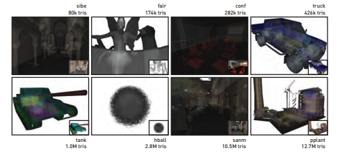

9.2节展示了在DXR中多重命中光线追踪的若干实现。这里，我们将在一个示例GPU光线追踪应用中探讨它们的性能。 

图9-2 用于性能评估的场景。八个具有不同几何和深度复杂性的场景被用于评估我们的各DXR多重命中实现的性能。若干场景中的首次命中可见表面隐藏了大量内部的复杂性，使得这些场景在多重命中遍历的性能测试中特别有用。

此应用的源代码和二进制版本均有提供[4]，允许读者自行探索、修改或是改进这些多重命中实现。