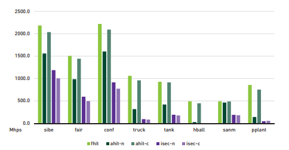
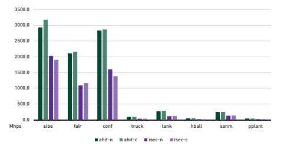
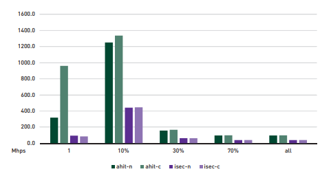

我们从图9-2所示的视角来渲染八个具有不同几何和深度复杂性的场景并报告我们的各个多重命中光线追踪实现的性能。对于每个测试，我们在1280 x 960的像素分辨率上使用从一个针孔摄像机发出的可见光线并对每个像素进行一次采样，先渲染50帧预热，随后渲染500帧作为基准测试。所报告的结果是500帧基准测试的平均值。测试在一台配备有单个NVIDIA RTX 2080 Ti GPU (驱动版本416.71)的Windows 10 RS4桌面PC上进行。我们的应用程序使用Microsoft Visual Studio 2017 Version 15.8.9进行编译并链接到Windows 10 SDK 10.0.16299.0 和 DirectX Raytracing Binaries Release V1.3。
在本节其余部分引用的图中，我们使用以下缩写来表示特定的遍历实现变体：
 - fhit：标准的首次命中光线遍历的直接实现。
 - ahit-n：朴素的多重命中光线遍历的任意命中着色器实现。
 - ahit-c：节点剔除多重命中光线遍历的任意命中着色器实现。
 - isec-n：朴素的多重命中光线遍历的相交着色器实现。
 - isec-c：节点剔除多重命中光线遍历的相交着色器实现。
阐释结果时请参考这些定义。
###### Find First Intersection/查找首个交点
首先，我们测量将多重命中光线遍历特化为首次命中遍历时的性能。图9-3比较了使用标准首次命中遍历和使用多重命中遍历找到最近的交点(即Nquery = 1)时的性能，单位为百万次命中每秒(millions of hits per second, Mhps)。在这种情况下，节点剔除的优势显而易见。使用任意命中着色器的节点剔除多重命中BVH遍历达到了接近标准首次命中遍历(平均约在94%以内) 的性能。然而，使用相交着色器的节点剔除实现总体上表现最差(平均超出4倍)，两种朴素的多重命中遍历变体对于我们的测试场景的性能比首次命中遍历平均差2-4倍。

图9-3 用于查找首个交点的标准首次命中和各个多重命中变体的性能。该图比较了Nquery = 1时标准首次命中遍历和我们的各个多重命中实现的性能，单位为百万次命中每秒(millions of hits per second, Mhps)。

###### Find All Intersections/查找全部交点
接下来，我们测量将多重命中光线遍历特化为全命中遍历(Nquery = ∞)的性能。图9-4比较了使用每种多重命中变体收集沿光线的所有命中点的性能，单位Mhps。毫无意外，使用不同着色器实现的各个朴素的和节点剔除变体表现相似，差异基本都在多次试验的预期变动范围以内。

图9-4用于查找所有交点的各个多重命中变体的性能。该图比较了Nquery = ∞时各个朴素的和节点剔除变体之间的性能差异，单位Mhps。

###### Find Some Intersections/查找部分交点
最后，我们使用Gribble[3]考虑的Nquery值来测量多重命中的性能，即除了极端值Nquery = 1和Nquery = ∞之外，还包括每个场景中沿任意一条光线遇到最大交点数量的10%、30%和70%。查找部分交点可能是最令人感兴趣的一种情况，因为多重命中遍历在这种情况下无法特化为首次命中或全命中。为了简洁起见，我们仅检查卡车场景的结果；但是这些结果中所呈现的总体趋势也可以在其他场景中观察到。
图9-5展示了Nquery → ∞时对于卡车场景的性能。总体上，节点剔除的影响相比使用其他多重命中实现而言较为不明显。例如，参见Gribble[3]和Gribble等人[6]报告的结果。对于使用任意命中着色器的两种实现，节点剔除相对于朴素多重命中带来的对于性能的正面影响从Nquery = 1时的多于2倍降低到Nquery = ∞时的几乎为零。虽然如此，使用任意命中着色器的节点剔除实现总体上表现最好，通常显著优于相应的朴素实现 (或者至少不会更差)。与此相反，使用相交着色器的两种实现对所有Nquery值表现相似，并且两种变体总体上都显著劣于任何任意命中变体。

图9-5 多重命中对卡车场景的性能。该图比较了对于多个Nquery的值我们的各个多重命中实现之间的多重命中性能差异，单位Mhps。
