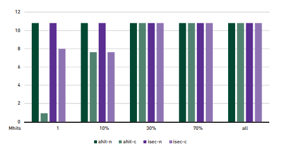
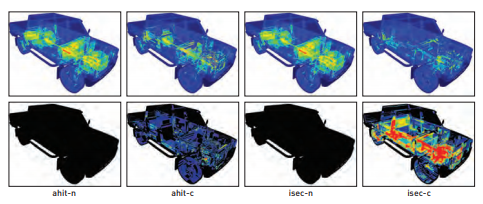

为了更好地理解上述结果，我们在图9-6中报告了每一种多重命中变体所处理的候选交点总数。我们看到，正如预期的那样，无论Nquery的值是多少，朴素的多重命中实现都会处理相同数量的候选交点。同样，我们看到节点剔除的确减少了处理的候选交点的总数，至少在Nquery小于30％时是如此。然而，在此之后，两种节点剔除实现都处理了与朴素的多重命中实现相同数量的候选交点。超过30％的阈值，在我们的测试平台上对于各个场景节点剔除相对于朴素的多重命中遍历并没有特别的优势。

图9-6卡车场景中所处理的候选交点的数量。该图比较了每一种多重命中实现所处理的候选交点数量，单位百万。

图9-6中的数据还表明，任意命中着色器变体所丢失的剔除机会(如9.2节所述)在实际中并不会影响整体的遍历行为。事实上，当整体观察三个实验的性能时，我们可以看到对于这里考虑的所有Nquery的值使用任意命中着色器的节点剔除实现的性能都要比使用相交着色器的相应实现平均高出2倍以上。

图9-7 效率的可视化展示。使用彩虹色表的热度图揭示出对Nquery = 9的情况使用节点剔除比使用朴素的多重命中遍历每条光线必须完成的工作少得多。然而，当比较两种节点剔除变体时，对于使用相交着色器，由更少的遍历步骤和光线/图元相交测试带来潜在节约被显著增加的光线区间更新所抵消(第二行)。在这种情况下增加的开销超过了节约的收益。

尽管使用DXR机制为用户定义的几何结构实现(否则为内置的)光线/三角形求交时出现的效率低下可能是导致两种节点剔除变体之间巨大性能差距的原因，但图9-7中的可视化视图提供了一些额外的解释。第一行描绘了每一种多重命中变体在Nquery = 9，即沿任一光线最大命中数的10%的情况下所处理的候选交点数量；而第二行描绘了每种实现所调用的区间更新操作的次数。正如所料，两种朴素的多重命中实现是等同的。它们处理了相同数量的候选交点并且不会进行任何区间更新。类似的，两种节点剔除变体都减少了所处理的候选交点的数量，使用DXR 相交着色器的实现会比相应的任意命中着色器变体处理更少的交点(7.6M 对比 8.5M)。然而，该实现却比任意命中着色器实现施加了明显更多的区间更新(1.7M 对比 837k)。这些更新操作是两种实现之间用户层执行路径差异的主要来源。因此，在DXR相交着色器实现中更频繁的剔除机会实际上引入了比剔除本身所节约的更多的工作并极有可能导致了这里观察到的整体性能差异。
