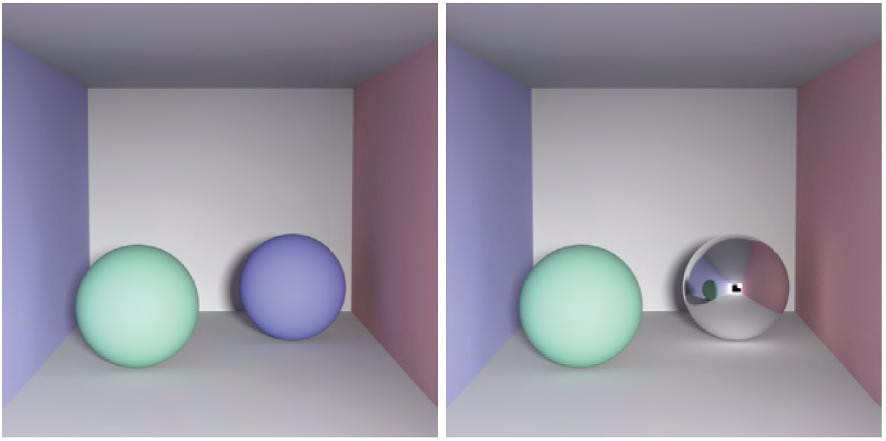
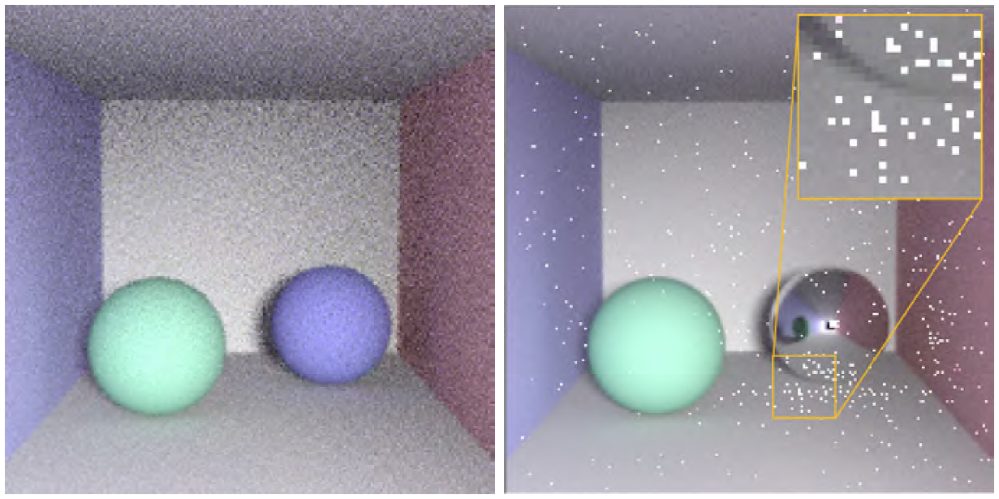
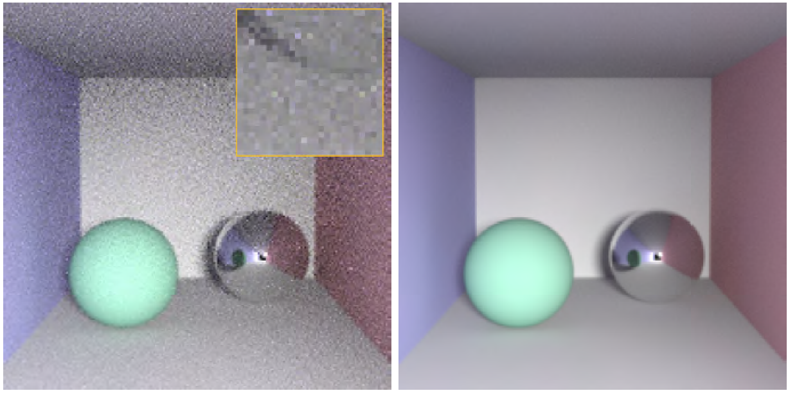

#第17章 免去路径追踪时的麻烦
###Ignoring the Inconvenient When Tracing Rays
作者 Matt Pharr，NVIDIA Research
翻译 Angie wei
## 摘要
&emsp;&emsp;光线追踪最伟大的力量是可以模拟所有种类的传输方式，同时这也是最大的弱点：当有几条路径比其它路径携带更多的光，产生的图片中会有少量明亮的尖锐噪点(spiky noise)像素。不仅需要大量额外的光线来均衡这些尖锐噪点，而且对于去噪算法也是一大挑战。本章介绍两个技术来解决这个问题，防止噪点的产生。
##简介
&emsp;&emsp;光线追踪是一个神奇的算法，图像合成中光线路径的精确模拟有绝对的保真度。光栅化的防真技术不再被要求产生高质量的图片，实时图形编程人员现在可以很高兴地移步到光线追踪中，通过追踪光路产生更漂亮的图片，从历史的枷锁中解放。现在让我们继续介绍这一新的黑科技。
##起因
&emsp;&emsp;如图17.1所示的两张图片，盒子中有一对球体都是通过路径追踪渲染(path tracing)，每个像素包含几千条的路径计算得到高质量的参考图。场景中有一个面光源（不可见），两个图像唯一不同的是右边球体的材质：左图是漫反射，右图是完全的镜面高光。
&emsp;&emsp;如果我们渲染这些场景每个像素用更真实的采样数量（这里用了16个）有趣的事发生了，图17.2结果显示，左图只有漫反射球体的场景看起来更好，然而镜面球体场景有明亮的尖锐噪点，有时也叫“萤火虫”，散布在场景中。

图17.1 一个简单的场景，被一个面光源照亮，用足够路径的路径追踪渲染得到高质量的参考图。两个渲染场景唯一不同的是左图的右边漫反射球体在右图中变成镜面的。

&emsp;&emsp;你可能认为这是一个正常的材质改变，而我们却看到了图像质量大量的破坏。为什么会这样呢？
&emsp;&emsp;为了理解这为什么会发生，想象一下我们通过随机选择图像中一部分像素的平均值作为图像像素的平均值。考虑执行这个任务在图17.1中两个收敛的图像（converged image）。在有两个漫反射球体的场景中，大部分像素有大致相同大小的值，因此，无论你选择哪个像素，计算的均值都会在大致正确的范围。
&emsp;&emsp;在高光球体的场景中，注意我们可以看到在镜面球体上有一个小的来自光源的反射。在少数情况下碰巧选择某个光源可见的像素来计算均值，这会增加光辐射量（light's emission），然而大多数时候我们完全不会选中它。
&emsp;&emsp;考虑到光的尺寸小及其与场景的距离，光源需要相当大的辐射量（emission）提供足够的光照(illumination)来照亮场景。这里，为了最终的着色像素值大致在[0,1]范围，光的辐射必须是 (500, 500, 500) RGB，因此，如果包含一个光的反射是可见的像素而且只有采样少量像素点，将严重高估真实的平均值。大部分情况下我们不包含这些像素中的某个时，由于我们没有包含任何高值像素，我们会低估均值。
&emsp;&emsp;现在回到图17.2中的渲染图，当路径追踪(path tracing)时，表面中的每个点我们会追踪一个新的光线，我们或多或少要面对与上文中求图像均值相同的问题：我们正试图用几束光线来估算到达该点的光线的余弦和BSDF加权平均值。当世界空间在所有方向上基本相似时，只选择一个方向会工作的很好。而当它在一小部分方向上有很大的不同时，就会遇到麻烦，随机地对一小部分像素的平均值估计过高的。反过来说，表现为我们在图17.2右图中看到的那种尖锐噪点（spiky noise）。

图17.2 实例场景，每像素16点采样渲染。左图：仅有漫反射球体的场景表现良好，可以很容易地去噪为高质量的图像。右图：有许多尖锐的噪点（spiky noise）像素，我们要采取一些方式来让图像好看

&emsp;&emsp;了解尖锐噪点产生的原因，我们在斑点的分布中可以看到一些有趣的东西：它们在能“看到”镜像球体的表面上更为常见。因为路径必须撞击镜像球体才能意外地找到返回光源的路径。请注意，在图像的左下角有无斑点的阴影；绿色球体遮挡了那些直接看到镜像球体的点。
&emsp;&emsp;这类噪声最大的挑战是当采样更多点时会变得很慢。再次考虑计算图像颜色均值的例子：一旦在总和中包含了 (500,500,500)颜色中的一个，要得到真正的平均值还需要相当多的在[0,1]范围内额外采样点。结果是，尽管（平均）情况有所好转，越多的采样会让图像看起来更糟：随着越多的光路被追踪，越来越多的像素将有随机击中光的路径。
##限定（Clamping）
&emsp;&emsp;解决这个问题最简单的方法是限定（clamping）。具体来说，我们对高于用户提供的阈值t的任何样本值c进行限定。以下是完整的算法：
$$c'=min(c,t)\tag{17.1}$$
&emsp;&emsp;图17.3 镜面球体场景渲染路径贡献被固定为3，不用说噪声要小得多。左图每像素16采样点被渲染（同图17.2的左图），右图已经收敛。
&emsp;&emsp;16个采样点的渲染图的尖锐噪点像素消失了，更接近一个好看的图像。然而，注意到1024采样的图像和最终图像之间的差异：我们已经失去了来自镜面球体下方地面和右侧墙壁光源的聚焦光（focused light）（所谓的焦散）。这是因为光照来自于少数高贡献度的光路（high-contribution paths），因此限定（clamping）阻止了它们对最终的图像贡献太多。

图17.3 镜面材质球体采用clamping被渲染，左图是每像素16点采样，右图是每像素1024点采样。注意到图17.2中尖锐噪点消失了，尽管我们失去了球体在地面和边上墙壁的光的反射效果，也称焦散（在图17.1中可见）。

##路径正则（Path regularization）
&emsp;&emsp;路径正则比限定(clamping)更好，它需要稍微多做一些工作来实现，但是它不会像上面方法那样受到能量的损失。
&emsp;&emsp;再思考下上文从几个像素计算图像平均值的练习：如果有一幅图像有几个很明亮的像素值，像镜面球体表面光的反射。然后可以想象如果你对图像进行模糊后选取像素做平均会得到更好的结果，这样，明亮的像素都会分散开来，并使其变暗，因为模糊后的图像有更小的方差，选择哪个像素无关紧要。
&emsp;&emsp;路径正则正是基于这一想法。这个概念很简单：模糊场景BSDFs(Bidirectional scattering distribution function, 双向散射分布函数)当被间接光线遇到，在这些点上执行正则化时，球体将变成有粗糙镜面(glossy specular)，而不是完全的镜面（perfectly specular）。
&emsp;&emsp;图17.4中的左图显示了算法在每像素16点采样的场景中被应用的结果，右图显示当图像在大约128点采样时收敛的效果。正则消除了尖锐的噪点，同时仍然保留了光的焦散反射(the caustic reflection)效果。

图17.4 左图：场景采用路径正则以每像素16点采样被渲染。注意到随机的尖锐的噪点(spiky noise)消失，而来自光源的焦散仍然存在。右图：一旦我们每像素累积128点采样，我们就会得到一个仍然包含焦散的相当干净的图像。

##总结
&emsp;&emsp;在光线追踪中有时我们会在图像中遇到尖锐噪点(spiky noise)，是由于局部明亮的物体或反射没有被很好地采样。理想情况下，我们可以改善我们的采样技术，但是并不总是可能或者说并不是每次都会得到正确的结果。
&emsp;&emsp;在这种情况下，限定(clamping)和路径正则(path regularization)都是有效的技术来得到高质量图像。这两种方法都很容易实现，限定方法只要在渲染器中增加一行，路径正则只要求记录是否非镜面在光路中被遇到，如果是，确保使随后的BSDFs减少镜面反射。
&emsp;&emsp;路径正则这种方法建立在一个比我们在这里描述的更具原理性的理论基础之上，详细请看Kaplanyan和Dachsbacher的论文[1]。
&emsp;&emsp;限定(Clamping)方法对应的一个更为原理性的方法叫抛弃离群值(outlier rejection)，与其他样品相比异常明亮的样品被丢弃。抛弃离群值法比限定阈值的(clamping)的方法更为鲁棒并且损失的能量更少。Zirr等人的文章中提出了一种最新的抛弃离群值法的GPU实现方案。
参考文献：
[1] Kaplanyan, A. S., and Dachsbacher, C. Path Space Regularization for Holistic and Robust Light Transport. Computer Graphics Forum 32, 2 (2013), 63-72.
[2] Zirr, T., Hanika, J., and Dachsbacher, C. Reweighting Firefly Samples for Improved Finite-Sample Monte Carlo Estimates. Computer Graphics Forum 37, 6 (2018), 410-421.
