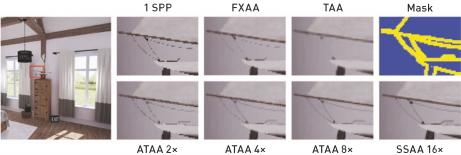
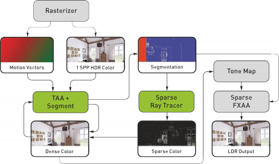
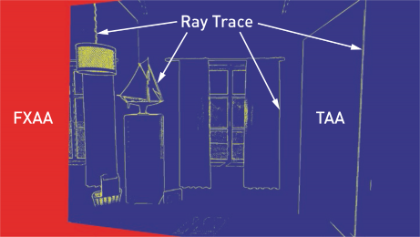
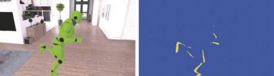
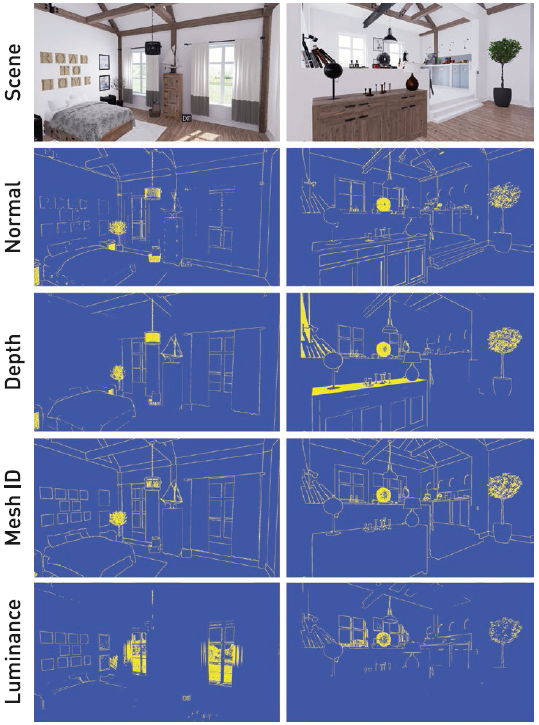
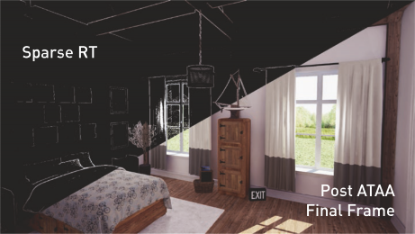
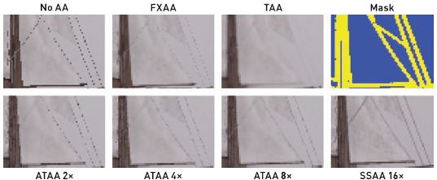
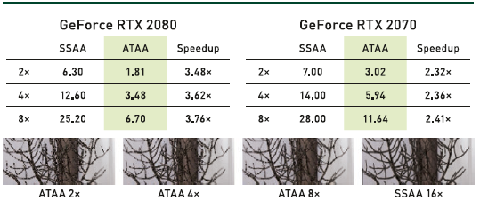
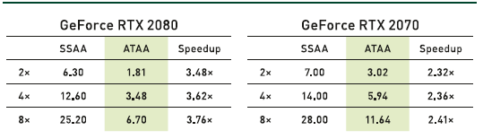
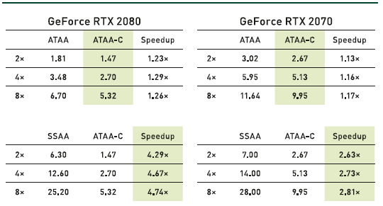

**# Improving Temporal Antialiasing with Adaptive Ray Tracing

# 通过自适应光线追踪改进时域抗锯齿

# 摘要
本章讨论了一种实用的实时超采样方法，该方法通过自适应光线追踪拓展了常用的时域抗锯齿技术。该方法适用于常见商业游戏中的限制环境，可去除常见时域抗锯齿技术中的模糊、伪影等走样失真。在大多数游戏所需的16ms帧预算时间内，可获得接近16倍的几何、阴影和材质等超采样渲染质量。

# 22.1 简介： #
渲染过程中处理图形元素时，非水平或者非垂直的线段常常无可避免地北处理成了锯齿或阶梯状的变形，这种视觉人工痕迹被称作走样/锯齿(Aliasing)。计算机图形学领域中，处理主可见表面的走样/锯齿现象是最基本和最具有挑战性的任务之一。常见的渲染算法都在单位像素空间内点采样曲面。因此，当采样点的分布不能完整表示像素内容时，也就是欠采样时，渲染算法产生采样错误。这种错误的产生和使用光线投射还是通过均摊式的光栅化算法进行可见性判断无关，也和具体的绘制算法无关。 甚至“基于点的”渲染器[ 15 ]实际上也会通过光栅化过程来做实际的光线追踪或将点元指向绘制屏幕。解析式渲染器（例如在空间和时间上进行完美的光束跟踪）可以避免光线（欠）采样问题。尽管现有一些解析式解决方案，然而使用的场景有限[ 1 ]。面对复杂的场景环境、材质和着色过程，从光线或者光栅格相交处进行点采样仍然是唯一完全有效的渲染方法。

欠采样引起的锯齿化具体表现为锯齿状边缘，空间噪声和时域上的闪烁现象（时间噪声）。为了掩盖这些错误，许多技术试图通过更大、更复杂的空间重建滤波器来把这些错误转变成模糊现象（空间层面）或者重影现象（时间层面）。这些技术包括空间层面上的形态抗锯齿（Morphological Antialiasing,缩写 MLAA）[ 22 ]，快速近似抗锯齿（Fast Approximate Antialiasing, 缩写 FXAA）[ 17 ]）和时间层面上的亚像素形态抗锯齿（ Subpixel Morphological Antialiasing, 缩写SMAA）[ 12 ] ，时域抗锯齿（ Temporal Antialiasing, 缩写 TAA）[ 13，27 ]。 在图像上每个像素固定的样本数下，唯一的真正解决方案是增加样本密度并限制被采样的像素信号强度。 增强采样密度有助于但不能保证以可接受的速率如实时速率来解决问题：超采样抗锯齿(SuperSampling Antialiasing，缩写SSAA)需要消耗与样本数量成线性比例的渲染开销，而却只增加平方根比例的质量。多重采样抗锯齿(Multisampling Antialiasing, 缩写MSAA)--包括覆盖采样抗锯齿( Coverage Sampling Antialiasing, 缩写CSAA)，基于表面的抗锯齿(Surface based Antialiasing, 缩写SBAA)[ 24 ]和亚像素重建抗锯齿(Subpixel Reconstruction Antialiasing, 缩写 SRAA) [ 4 ]，---这些技术以不同的速率对场景集合，材质和着色过程进行采样，从而启发性地降低采样成本，但同时也会降低质量; 同时增强式抗锯齿技术( 解耦覆盖抗锯齿（ Decoupled Coverage Antialiasing, 缩写DCAA）[ 25 ]，G缓冲增强抗锯齿（Aggregate G-buffer Antialiasing，缩写AGAA）[ 7 ]）)更大胆地降低了开销然而在可接受的交互帧率下只能提供有限的质量。 对于一些通信带宽受限的场景，通过mipmapping技术以及它的变体对材质进行预滤波[ 19 ], 设置分层级可控的几何细节以及分层级可控的着色器来减轻采样不足的影响，但同时引入了其他一些非凡的问题，例如过度模糊或跳跃现象（时间尺度和空间尺度的不连续），也同时使得渲染系统过度复杂化，无法完全解决问题。

实时渲染的常见标准是同时采用许多这些策略，重点利用时间抗锯齿。这样做在许多情况下成功的，然而对于特定的游戏解决方案需要相当的复杂工程开发和艺术家们精心手工设计调整的场景的[ 20，21 ]。所有这些解决方案都依赖于每个像素的固定采样数，因此如果在设计好的采样样本之间放置材质，几何或着色特征，这会导致产生无上限的误差。最近，Holländer等人[ 10 ]主动识别出需要通过粗略的着色和高分辨率几何图形进行抗锯齿的像素，并达到了与SSAA几乎相同的质量。不幸的是，即使仅仅需要识别出个别像素进行抗锯齿，这种基于光栅化的方法也需要以高分辨率的方式处理所有几何图元。尽管将需绘制样本的数量减少了一半，但帧时间的减少局限在10％左右。因此，我们认为对实时渲染来说，抗锯齿仍然是一个开放的挑战性问题。

本章介绍了一种新的实用算法，即自适应时域抗锯齿（Adaptive Temporal Antialiasing, 缩写ATAA），它通过使用自适应光线追踪超采样方式扩展光栅化图像的时域抗锯齿来解决锯齿问题。离线光线追踪渲染器长期以来一直采用高度自适应的样本数来解决锯齿化问题（例如，Whitted的原始论文[ 26 ]），但由于光线追踪和光栅化的API以及体系结构之间的存在数据重复，到目前为止，混合光线追踪方式和光栅化方式的算法[ 2 ]一直不适用于实时渲染。最近引入的DirectX Raytracing API（DXR）和NVIDIA RTX平台，使得数据结构和着色器在整个游戏引擎中的GPU上渲染过程中具有完全的互操作性。至关重要的是，RTX通过在NVIDIA Turing GPU架构上提供包围层次盒（BVH）遍历和三角片相交任务的硬件加速，大大提高了光线追踪性能。因此，通过展示如何有效地将最新的时域抗锯齿解决方案与GPU光线追踪的生态系统的最新发展相结合， 解锁新的混合渲染方法，从而实现自适应采样基本思想。如图22-1所示，我们的方法可适应商用游戏引擎的常见的约束环境，消除了与常见的时域抗锯齿相关的模糊和伪影，并实现了接近16倍几何，着色，材质超采样质量。在现代图形硬件上，只消耗了16毫秒的帧预算。我们提供了将ATAA集成到具有DirectX光线追踪支持的扩展的Unreal Engine 4（UE4）原型版本中的原型版本。通过调整光线追踪样本的自适应分布，实验了进行光线工作负载压缩优化，在NVIDIA Turing GPU上了解光线追踪性能。

-----

> 虚幻引擎4中的Modern House场景使用延迟渲染，光线追踪方式渲染结果。使用我们的自适应时域抗锯齿技术以及一个移动的相机，所有这些都在NVIDIA GeForce 2080 Ti上以9.8毫秒的速度渲染。放大的局部图比较了使用每个像素一个样本（1 SPP）光栅化渲染的船绳细节，FXAA，UE4的内建的TAA，一个可视化的分割蒙皮，ATAA 2×，4×和8×，以及SSAA 16×参考对照。
> 

#22.2 时域抗锯齿相关工作#

时域抗锯齿[ 13，27 ]处理速度快，在能处理的场景下能得到相当好的质量，这也使得该技术成为如今游戏渲染领域的一个事实标准。TAA在每个帧图像上施加一个子像素位移（该轻度位移限于一个像素距离内），并使用之前帧的累计值指数加权平均。因此每个前帧每个像素做到了仅用一个样本进行渲染。在静态场景中，TAA结果接近使用全屏超级采样的质量。对于动态场景，通过沿光栅化器生成的每个像素上的运动矢量偏移纹理，TAA方法提取过往累计历史缓冲帧中的对应采样位置，从而实现加权平均。

TAA在某些情况下会失败。一种是可见性不一致：当渲染对象运动后，新的屏幕区域中遮挡了历史帧中的区域，或显示了原来不存在的部分。这些绘制区域或者在历史缓冲帧区域中无法表示，或者被运动矢量错误表示。相机旋转和向后平移也会在屏幕边缘产生严重遮挡。一种精细采样失败：在连续偏的光栅化样本之间，一些子像素特征如线条和精细的材质细节可能会捕获失败，从而导致下一帧无法用运动矢量表示。此外特殊渲染过程：如根据透明表面对应的像素所创建的运动矢量，与所表示对象的总运动不匹配。阴影和反射不会在被其对应绘制的表面的运动矢量的方向上移动。

当TAA失败时，它会产生重影（由于积分不正确的值而导致的模糊）或显示原始的锯齿，抖动和噪声。标准的TAA尝试通过将历史样本与新帧中相应像素的本地邻域进行比较来检测这些情况。当它们带有严重不同的值时，TAA会采用各种启发式方法在色彩空间中进行裁剪，截断或插值。正如Salvi [ 23 ] 总结的那样，为取得最好的效果这些启发式方法在实践中经常变化，且尚未找到通用解决方案。

# 22.3 一种新算法 #

我们设计了自适应时态抗锯齿技术，以与常规游戏引擎兼容，并充分利用TAA的优势，简单直接地解决它的固有缺陷。核心思想是在大多数像素上运行TAA的基本流程，然后，并非尝试通过启发式方法解决缺陷，而是输出一个保守的分割掩膜，以识别TAA失败的像素以及成因。然后，我们使用鲁棒的替代方法（如稀疏光线追踪自适应图像内容）替换故障像素处TAA的复杂启发式方法。

图 22-2 显示了我们在虚幻引擎4 渲染管线中的算法。在该图中，矩形图标表示数据（缓冲区）的可视化，而圆角矩形表示操作（着色器通路）。注意该图并未显示所有中间缓冲区。例如，在前一帧的输出作为TAA的输入反馈的情况下，该图没有展示相关的乒乓缓冲区。新的稀疏光线追踪步骤在DXR 光线生成着色器中执行，接受新分割缓冲区，然后输出一个新的Sparse Color缓冲区，该缓冲区与TAA的颜色输出混合后进行色调映射和其他屏幕空间后处理过程。

由于TAA的基础结果对于大多数屏幕像素都是可以接受的，因此光线追踪的成本将被摊销，并且所需的光线预算远远少于每个像素一个样本。例如，我们可以自适应地采用8x射线跟踪超级采样，以达到总图像分辨率的6％，而每个像素的成本少于0.5射线。这样，图像质量在任何地方都至少相当于8倍的超级采样；否则，由于采用了不同的算法，分割区域之间的边界将在最终结果出现中闪烁现象。

## 22.3.1 分割策略 ##

任何一种高效的自适应采样方法关键是首先找出最能受益于改进的采样图像区域（即，检测欠采样区域），然后仅在这些区域中执行附加的采样。在ATAA中，我们通过计算可检测欠采样和TAA策略故障的屏幕空间分割掩膜来指导光线追踪超采样的适应性。在图 22-2 中标记为“分割”的缓冲区是为Modern House场景生成的细分掩膜的可视化效果。图22-3给出了此掩膜的更大的带注释的版本。我们的掩膜可视化将抗锯齿策略映射成像素颜色其中红色像色使用FXAA，蓝色像素使用TAA，黄色像素光线追踪超采样。如何同时兼顾性能和结果图像质量，是一个具有挑战性的问题。可用于抗锯齿的光线预算会根据场景内容、视点、视景体、以及每个像素上的照明和视觉效果、GPU硬件、目标帧率等而不同。因此我们不提倡“一刀切”的分割策略，而是将其分类、分别讨论多个选项，以便在各种情况下实现最优组合策略。

-----

>图22-2。ATAA的算法流程已集成到UE4渲染管线中。灰色框表示未更改或稍加修改的操作。绿色框代表已修改或新的操作。分割和稀疏颜色缓冲区是新的。
>
-----
>
图22-3。ATAA分割蒙版的带注释的可视化。蓝色像素使用标准TAA，红色像素使用FXAA，黄色像素使用光线追踪超采样。
>

### 22.3.1.1 自动分割 ###

通过检查光栅化后屏幕空间中可用的场景数据，可以有效，高效地分割图像。由于分割是通过算法生成的，因此无需艺术家或开发人员的手动干预，因此我们将此过程称为自动分割。

现代渲染引擎在每个像素上维护一个运动矢量，在分割过程中我们使用该矢量来确定当前像素之前是否在视图之外（如屏幕外）或被另一个表面遮挡。在此类离屏遮挡的情况中，不存在用于抗锯齿的光栅化历史数据。如图 22-3 所示，我们用FXAA（红色）处理这些区域，因为它使用成本低，不需要历史数据并且在低动态范围输出上运行（即在色调映射之后），以节省内存带宽。通过仅在屏幕外遮挡像素上运行FXAA，与全屏应用相比，我们可以进一步降低其成本，即使对于快速移动的相机，通常也可以将其成本降低到少于15％。在动画对象和蒙皮角色的渲染中，存在光栅化数据，但其着色部分并不能对应当前可见面。如图22-4所示，我们通过忽略其时域上的光栅化数据并将这些像素标记为光线追踪超采样（黄色），从而消除了常见的TAA重影伪影，并避免了由TAA阶段引起的锯齿化。检查运动矢量的结果将优先于所有其他条件，如果存在以上所述任意一种遮挡，则会触发分割过程中的提早退出。既然已经处理了来自遮挡类的TAA故障，接下来分割过程转向识别欠采样区域。

-----
>图22-4。跑步动画中间的蒙皮（左）。运动矢量用于确定导致TAA故障的排除。通过标记这些区域以进行射线跟踪的超级采样，可以消除TAA重影伪影并消除锯齿现象（右）。
>

欠采样伪像主要出现在几何边缘和高频材质着色过程中。与常见的边缘检测算法相似，我们执行一组3×3像素卷积以确定表面法线，深度，模型网格标识符和亮度的屏幕空间上梯度。图22-5直观显示了每种数据类型的分割结果。

在图22-5中未显示，我们还比较了当前像素的亮度和TAA历史缓冲区中重新映射到的像素位置的亮度，以确定亮度在时间和空间上的变化。由于我们的抗锯齿方法可以通过光线追踪准确地产生新的样本，因此重映射或潜在的遮挡不会引入误差。

正如您可能已经注意到的，单就每种屏幕空间数据类型都无法提供我们想要的完整分割。表面法线梯度可以有效地识别对象的内部和外部边缘，但是会丢失具有相似法线和欠采样材质的分层对象。深度梯度可以很好地检测分层对象和深度不连续性，但是会产生大面积的错误识别，在这些区域中，深度的急剧变化很常见（靠近视图边缘的平面，例如墙）。模型网格标识符梯度在检测物体外部边缘方面表现出色，但会错过物体内部欠采样的边缘和材质。最后，亮度导数可检测到欠采样的材质（在空间和时间上），但是会漏掉亮度值相似的边缘。结果是，必须使用这些上述梯度的组合以得到一个可接受的分割结果。
-----
>
图22-5。从Modern House场景中的两个角度对各种类型的屏幕空间数据进行3×3像素卷积的分割结果：从上到下，最终渲染场景，表面法线，深度，模型网格标识符和亮度。

###UE4中的自动分割实现###

在我们UE4实现中，通过扩展现有的全屏TAA后处理通道来生成分段掩膜。检查TAA故障的运动矢量后，我们按照一定加权组合使用使用模型网格标识符，深度，和时域亮度以达到最终的分割结果。掩膜存储为两个半精度无符号整数值，打包到单个32位内存资源中。第一个整数标识像素的抗锯齿方法（0 = FXAA，1 = TAA，2 =光线追踪），第二个整数用作存储分割的历史记录，用于记录该像素是否在先前的帧中进行过光线追踪超采样。分割分类历史对于在时域上稳定分割掩膜结果非常重要，因为对于TAA，每个帧视图都使用了子像素抖动。如果将像素标记为进行光线追踪超采样，它将继续被分类成在接下来的几张新帧中进行光线追踪，直到对应像素运动矢量的显着变化重置了分割历史。存储分割历史记录的另一种替代方法是在光线追踪的超采样之前过滤分割掩膜。

** 译者马雷：此处问题

###22.3.1.3 手动分割###

不同项目中的艺术要求、内容呈现和性能指标千差万别，也因此对实时渲染图像提出了独特挑战。这导致了自动分割方法可能不会总是自动产生适合每个项目性能开销的结果。艺术家和游戏开发者最了解他们的艺术设计、游戏等所要呈现内容的特色和约束；如此，手动分割在此类情况中会很有效。举例来说，艺术家和开发人员可以标记特定类型模型网格、绘制对象或者材质，在光栅化过程中用以写入分割掩膜。比较实用的例子如细发，电话线，绳索，围栏，高频材质以及始终保持较远的几何模型。与模型网格自动细分策略相似，手动分割也可以用几何元数据、基于到视点的距离、材质甚至所需的抗锯齿类型（例如，内部边缘，外部边缘或材料）等来指导光线追踪的超采样的适应参数。

##22.3.2 稀疏光线追踪超采样##

准备好分割掩膜后，使用以分割掩膜的分辨率分配的DXR光线生成着色器进行新的稀疏光线追踪通路，实现抗锯齿效果。每个光线生成线程都会读取掩膜的一个像素，确定该像素是否标记为光线追踪，如果标记为是，就进行在8X，4X或2X MSAA n-rooks 子像素采样模式的光线投射。光线相交命中时，，执行与光栅化管线相同的HLSL代码来执行完整的基于UE4节点的材质图和着色管线。由于DXR光线生成和命中着色器中不提供前向差异导数，因此我们将它们视为无穷大，以强制使用最高分辨率的纹理。因此，我们仅依靠超采样来解决材质锯齿问题，这是大多数电影渲染器的方式，以获得最高的质量。另一种方法是使用距离和方位解析选择的mipmap水平或采用光线微分[ 6，11 ]。图 22-6 显示了使用我们的方法渲染图像的组合图，显示了稀疏光线追踪步骤的结果（顶部）和最终的合成ATAA结果（底部）。

-----
>
图22-6。使用我们的方法渲染的组合图像，展示了稀疏光线追踪步骤的结果（顶部）和最终的合成ATAA结果（底部）。
>

###22.3.2.1 子样本分配和重用###

基于光栅化过程的采样（包括用于抗锯齿的采样）仅限于图形API可用的采样模式，可以在硬件中高效实现。尽管可以将完全可编程的样本偏移功能添加到光栅化器的管线中，但是这种功能目前尚不可用。相反，DXR和其他光线追踪API使光线可以从任意的原点和方向投射，从而在采样时具有更大的灵活性。例如，如果所有的有效样本都存在于像素的右半部分，则可调整投射光线以对右半部分进行密集采样，而使左半部分稀疏采样（或根本不采样！）。尽管可以使用完全任意的样本模式，并且对于某些特定用途可能值得使用某种潜在特定样本模式，我们仍然建议使用更实用的方法。

为了在我们的混合算法中保持样本分布与周围像素的均匀对等，自然地，我们用于TAA相同的抖动样本模式应和光栅化器相同。使用ATAA，我们可以在每个时间步从一组采样位置生成样本，从而获得更高质量的新样本，并减少了对重新映射的历史值的依赖。例如，如果TAA有一个8帧抖动采样模式，并且我们正在执行8倍自适应光线追踪超采样，使用每帧的光线评估所有8个抖动采样位置。光线追踪超采样然后产生与TAA 在综合之前历史帧的纹理过滤结果进行收敛后的相同的值。类似地，仅在两个帧中，一个4倍自适应光线追踪样本模式会收敛到8倍TAA计算值。

尽管最初在光线追踪和光栅化之间匹配样本模式似乎是最好的方法，但不同的样本模式可能使自适应光线追踪能够以8倍采样在仅仅4帧上收敛到32倍质量。我们从用于生产的渲染器[ 3，5，8，9，16 ]中寻找灵感以确定更高计数的采样模式。相关多抖动采样[ 14 ]是目前普遍使用的一种方法。尽管改进的采样模式会产生更高质量的结果，但在屏幕空间中紧靠TAA结果放置时，不同采样方法之间的不连续性可能会很明显，需要进一步评估。

#22.4 初步结果#

为了演示ATAA的实用性，我们在Unreal Engine 4的原型分支中扩展了DirectX光线追踪功能，实现了该算法。我们使用了Windows 10 v1803（RS4），Microsoft DXR，NVIDIA RTX，NVIDIA 416.25驱动程序以及GeForce RTX 2080和2070 GPU的配置生成结果。

##22.4.1 画面质量##

图22-1和22-7展示了Modern House场景的输出结果比较，图22-6展示了全部比较，放大到细绳几何形状的场景中富有挑战性区域。在图22-7中，“No AA”图像展示了从每个像素的单个光栅化样本获得的基准锯齿图像。FXAA和TAA图像表示用UE4中标准实现生成。SSAA 16倍图像来自16倍超采样。我们展示了使用的ATAA分割掩膜以及每个像素具有2、4和8光线的ATAA的三种变体。由于很难在静态图像中捕获标准TAA的缺点，并且所有TAA图像都来自稳定的会聚帧，因此看不到典型的TAA运动伪影。图22-8显示了来自同一场景的输出结果比较，将其放大到具有复杂分支的植物的富挑战性区域。两种结果进行比较时，请注意标准TAA如何错过或模糊掉落在样本之间的子像素区域中的细小几何图形，而ATAA的分割步骤可识别围绕这些困难区域的大部分区域，并通过使用光线追踪超采样来避免重影，模糊和欠采样。

-----
>
图22-7。Modern House场景中的缩放图像突出了一个具有挑战性的区域，该区域具有细小的绳索几何形状，将通过1 SPP光栅化渲染的绳索细节，FXAA，UE4的内建TAA，我们的分割掩膜的可视化图像，ATAA 2×，4×和8×进行比较，以及SSAA 16倍基准图像作为参考。
>
-----
>
图22-8。Modern House场景中的缩放图像突出展示了一个具有挑战性的区域，该区域具有植物的复杂细节，将通过1 SPP光栅化渲染的植物细节，FXAA，UE4的内建TAA，我们的分割掩膜的可视化图像，ATAA 2×，4×和8×进行了比较，以及SSAA 16倍基准图像作为参考。
>

##22.4.2 性能##

表22-1 展示了与同等配置的SSAA相比，ATAA的GPU时间（以毫秒（ms）报告）。ATAA以1080p分辨率渲染图像，为抗锯齿而投射的光线数量根据分割掩膜而有所不同。图22-6中所示的Modern House场景用于性能测试，并且分割掩膜为光线追踪超采样识别出103,838像素。这些像素仅占总图像分辨率的5％，但结合无故障的TAA结果（分割掩膜中的蓝色像素），ATAA自适应地产生类似于SSAA的结果，而成本要低得多。由ATAA投射的主光线还将阴影光线投射到场景的定向光源（太阳）以确定遮挡。此外，当整个帧都是新帧时，FXAA传递会增加多达0.75 ms，实际上由于在掩码中为FXAA识别的像素更少，因此线性缩减到0 ms。在常见的相机运动下，为FXAA选择的像素少于5％。
>
表22-1。比较GeForce RTX 2080和2070 GPU上几种SSAA和ATAA GPU运行时间（以毫秒为单位）。ATAA以1080p分辨率运行，并选择103838像素进行光线追踪超采样。在需要抗锯齿的挑战性区域中，ATAA产生的结果与SSAA相比要高出2倍至4倍。
>

-----

在Modern House场景中，即使采用相对未优化的实现方式，与SSAA相比，ATAA的自适应特性也会产生2到4倍的提速。这些初步结果在新的硬件，新的驱动程序和UE4原型分支中的实验性DXR API中获得，而UE4的原型分支并不是为光线追踪而设计。因此，优化ATAA算法实现和游戏引擎的DXR光线追踪功能性能仍有较大空间。

ATAA其中一个优化方法是创建一个紧凑的一维缓冲区，该缓冲区包含为光线追踪超采样确定的像素位置，而不是与分割掩膜对齐的屏幕空间缓冲区，并且仅根据此一维缓冲区元素来分配DXR光生成着色器线程。我们将此过程称为 光线工作量负载压缩。表22-2比较具有压缩优化和不具有压缩优化的ATAA的GPU时间。与原始的ATAA实施相比，压缩可将性能提高13％至29％，与等效的SSAA配置相比快约2.5倍至5倍。这是一个令人兴奋的结果，但是需记住，分割掩膜（以及由此产生的光线追踪工作量）在每一帧中都会动态变化。因此，光线追踪负载压缩可能并不总是有益的。在整个项目中，进行各种渲染工作量的实验，才会发现哪种优化方法能实现最佳性能。

>
表22-2。比较GeForce RTX 2080和2070上的ATAA和带有光线工作量负载压缩（ATAA-C）的ATAA的GPU时间（以毫秒为单位）（上）。压缩将Modern House场景下工作负载的性能提高了13％至29％，并且比等效的SSAA配置（底部）的执行速度快约2.5倍至5倍。由于性能会随几何形状和材料的不同而变化，因此压缩并不总是可以提高性能。
>
-----

#22.5 局限性#

ATAA不能全面解决在实现“混合光线追踪和光栅化抗锯齿”时可能遇到的每个问题。例如，分割掩模被限制为发现每个像素在单个时间抖动样本的几何形状。结果，可能会错过子像素的一些细节几何形状。这会在分割掩膜中出现和不出现的细节几何图形之间造成空间交替，因此会导致在高质量的光线追踪超采样和完全丢失的几何图形之间发生转换。尽管解决该问题的渲染方法几乎全部包括提高基本采样率，但美术师可能能够通过适当地修改几何形状或在将几何形状放置到距相机一定距离之外时生成替代级别的细节表示来缓解这些问题。此外，以跟踪更多光线的代价，早于光线追踪过程滤波分割掩膜也可增加掩膜的时域稳定性。

****译者 前向差异微分？最高频率纹理？

由于DXR中的材质评估无法正确计算和评估纹理mipmap级别，因此与SSAA相比，ATAA的抗锯齿结果存在细微差别。在现有面向生产游戏引擎中，对光线追踪的样本进行着色时，纹理采样特别具有挑战性。尽管可以计算光线差异，但是现有材质模型的实现很大程度上取决于光栅化管线提供的前向差异导数。因为不能使用一组光线微分来调整纹理采样时使用mipmap级别，这使得光线微分计算特别昂贵。在我们的实现中，所有光线样本都选择最高频率的纹理。这种限制在许多情况下会导致纹理走样，但是在较高的样本数量下，我们能够重建适当的滤波结果。另外，TAA历史记录和新的光栅化样本已滤波纹理采样，可以将其与我们的光线追踪样本混合以减轻纹理走样。

光追踪抗锯齿用于主可见性判断的另一个实际困难是支持屏幕空间效果。由于光线稀疏地分布在整个屏幕空间中，因此无法保证用于后处理效果(诸如景深，运动模糊和镜头光晕等)的必要数据存在附近的像素中。一种简单的解决方案是在这些步骤通过之前进行抗锯齿过程，其代价是这些效果不会从抗锯齿中受益。从长远来看，随着光线样本的预算增加，将基于光栅化的屏幕空间效果转换为光线追踪的等效效果可能是明智的方向。

#22.6实时光线追踪抗锯齿技术的未来#

具有用于光线追踪的专用加速功能的图形处理器的新近出现为重新评估现有技术提供了机会，从而又重新发明了实时抗锯齿功能。本章介绍了最初发布的ATAA [ 18 ] 的文章之外更多的实现细节，并且可以作为将来的面向生产渲染器的基础。面向生产的部署的主要剩余问题是确保稀疏光线追踪过程的运行时间能在可用的帧时间预算内运行。一旦选择了用于光线追踪超采样的像素，我们建议采用其他启发式方法来调整性能，包括在命中目标之后简单地丢弃一些光线、在屏幕空间区域中不优先处理不太常见或在感知上不太重要的光线，并根据嵌入在分割掩膜中的优先级度量矩阵选择光线计数。我们期望调整每个像素的光线计数将改善给定区域中的光线追踪性能。

基于当前GPU的SIMD架构，这些调整是在扭曲的边界上以最优的方式进行，因此需要类似样本计数的像素可能会在生成工作时受益于放置在一起，这个任务也可以在工作负载压缩通路中完成。

#22.7结论#

主表面锯齿化是计算机图形学中的最基础问题之一。离线渲染中最著名解决方案是自适应超采样。对于复杂材质和场景的光栅化渲染器，以前是不切实际的，因为无法有效地光栅化稀疏像素（问题像素）。即使是最高效的GPU光线追踪器，也需要大量的着色器和场景数据。尽管DXR解决了将光栅化和光线追踪相结合的技术难题，但应用光线追踪以通过超采样解决锯齿化并不是一件容易的事：仅给出1个SPP输入时就知道要对哪些像素进行超采样，并将成本降低到简单光线追踪无法解决的规模。

我们已经展示了针对此问题的实用解决方案 - 它是如此实用，以至于它可以在商业游戏引擎中运行，甚至可以在第一代商业实时光线追踪硬件和软件上实时运行，并连接完整的着色器管道。在电影渲染器通过首先投射每个像素很多光线来选择像素进行自适应超采样的情况下，我们改为利用TAA的历史记录缓冲区来检测锯齿化现象，从而在许多帧上分摊该成本。我们进一步确定由于遮挡而造成的较大的瞬态走样区域，并在那里使用后处理FXAA，而不是消耗光线。这种混合策略利用了最复杂的实时抗锯齿策略的优势，同时消除了许多限制。通过将我们的超采样结果反馈回TAA缓冲区，我们还增加了这些像素不会触发后续帧上超采样的可能性，从而进一步降低了成本。